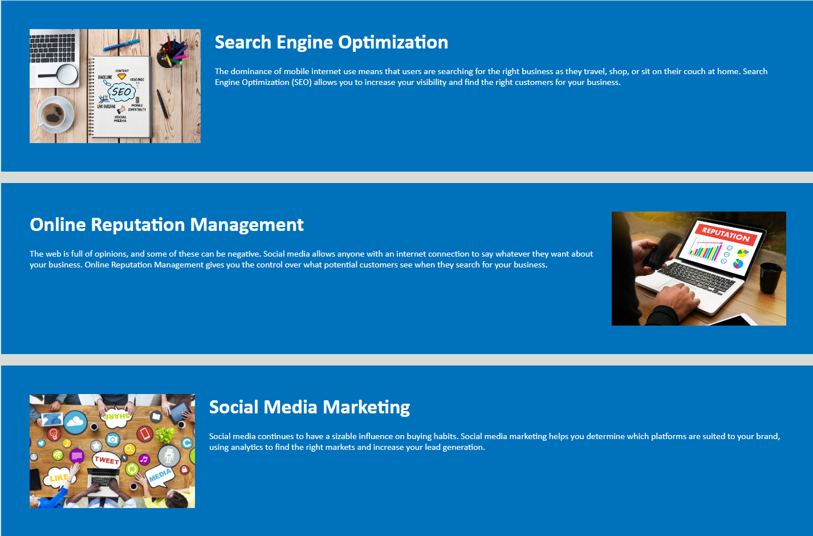

# BWang Horiseon Website

## Week 1 Module 1 Challenge - UCI Bootcamp

This was our first challenge project of our bootcamp. Overall, we were given a basic website that included HTML and CSS files already written out. We were then asked to edit the semantic HTML and make sure that our CSS matched the new semantics of the HTML code. I got rid of most if not all of the divs in the HTML and made sure to follow the semantic guidelines. 

## Table of Contents

- [Installation](#installation)
- [Usage](#usage)
- [Credits](#credits)
- [License](#license)

## Installation

N/A

## Usage

The website is live [Horiseon][https://wangbrian26.github.io/Mod1-Challenge/#social-media-marketing]

This is the front page of a website for a company. There is a site navigation tool on the top of the page. 

- Clicking on "Search Engine Optimatization" takes you to that section of the page. 
- Clicking on "Online Reputation Management" takes you to that section of the page. 
- Clicking on "Social Media Marketing" takes you to that section of the page. 

## Credits

Credits to Andrei from class for helping with the CSS. Also thanks to Instructor Quinton Fults, TA Takara Truong, and TA Black Marcus for helping with the learning on these elements.

## License

N/A